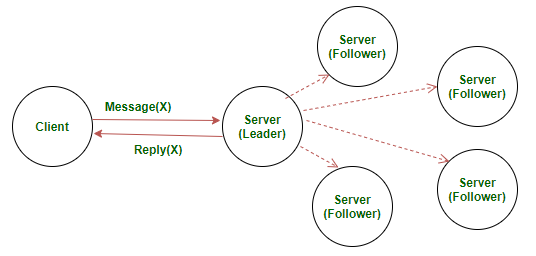

# Vesper
A fault-tolerant distributed key-value store using the Raft consensus algorithm.

## What is Raft consensus algorithm?

In a distributed system, data replication is needed for either fault-tolerance or latency optimization. Maintaining a consensus among all replications is crucial for the correctness and robustness of the distributed system. Various algorithms emerge to address this problem. Raft is an alternative designed to Paxos, aiming to be more understandable and to offer the same level of safety and robustness.

Raft employs a leader approach where there is one and only one elected leader node, with the rest of nodes in a follower state. Log replication across the system is managed by the leader node. Leadership continues until it fails or disconnects, and a new leader is elected in such case.



### Leader Election

The election starts when the current leader fails/disconnects or at the beginning of the algorithm. A new *term* starts in the system with a random period for the new leader to be elected. If the election successes with a single new leader winning, the term carries on and the new leader takes over to coordinate the normal operations. Otherwise, the term expires to yield another round of the election.

An election is started with one or more node assumes candidacy, which is the result of not receiving any communication from the leader over a certain amount of timeout. Timeout is randomized to minimize the impact of the split vote. Each server vote once per term, on a first-come-first-served basis. Candidate votes for itself and request voting to other nodes. If a candidate receives a request from another candidate with a higher term, it will update its term and vote positively to that request, otherwise, if the request is from a lower or equal term candidate, the received request will be discarded. When the majority votes for a candidate, that candidate wins the election. 


### Log Replication

Log replication is managed by the leader. Clients requests are handled by the leader, which consist of a command to be executed by the replicated state machines in the system. The leader first logs this locally and spreads the messages to all the follower about the updated entry. Followers log the updates in the message, and feedback to the leader as a consent to the update. Once the majority consents to the update, the leader will then "commit" this transaction to its local state machine and respond to the client about the success. Messages to inform all the followers to commit their replicates are sent at the meantime. The "commit" actions to transact all the previous staged logs if any was left undone.

Logs could be inconsistent in the case of leader crash, where some previous logs are not fully replicated to all its followers. In such cases, the new leader will request the followers to update their logs to reach consensus with the leader's state.

###### A scrutinized analysis on how our implementation fulfills the design is available upon [request](mailto:dingpeng@uchicago.edu).

## How to run the SERVER

Each server is initialized with an index and an `ip_list.txt`
```
usage: python3 server.py <id> <ip-list-file>
```

there is a file called `ip_list.txt` that has a list of IPs of the servers, the consensus majority will be calculated based on the "number of servers" (#lines) in this file. Make sure there are **no empty** lines!

example of 5-server `ip_list.txt`

```
http://127.0.0.1:5000
http://127.0.0.1:5001
http://127.0.0.1:5002
http://127.0.0.1:5003
http://127.0.0.1:5004
```

 example of running 5 servers
```
➜  python3 server.py 0 ip_list.txt
➜  python3 server.py 1 ip_list.txt
➜  python3 server.py 2 ip_list.txt
➜  python3 server.py 3 ip_list.txt
➜  python3 server.py 4 ip_list.txt
```

## How to run the CLIENT
the client can perform `GET` and `PUT` request from the command line.

- the first argument is always the `http://ip:port` of a functioning server
- the second is the `key`
- the third is optional and is a `value`
  - if the `value` **is** present the client performs a `PUT` request with key and value to the specified server
  - if the `value` **is not** present the client performs a `GET` request of the key to the specified server

```
PUT usage: python3 client.py 'address' 'key' 'value'
GET usage: python3 client.py 'address' 'key'
Format: address: http://ip:port
```

example of `PUT` key="name" , value="Leslie Lamport"
```
➜  python3 client.py http://127.0.0.1:5000 name "Leslie Lamport"
{'code': 'success'}
```
example of `GET` key="name" 
```
➜  python3 client.py http://127.0.0.1:5000 name 
{'code': 'success', 'payload': {'key': 'name', 'value': 'Leslie Lamport'}}
```

## Communication between client and server

The client interacts with the server in REST fashion, with an HTTP request to the route `/request` using the mandated JSON format as a body of the request.

### `GET` request

`@app.route("/request", methods=['GET'])`

- if we are the leader: we access the store and reply with key and value
- if we are a follower: we reply with the IP address of the leader, the clients automatically retries to send the same request to the leader
- if we are a candidate we reply with a failure, it means an election is going on and we do not know who is the leader right now.

### `GET` reply

- if the key is present in the storage a `code`:`success` is returned, with a payload of `key` and `value`
- else a `code`:`fail` is returned with no payload

### `PUT` request

`@app.route("/request", methods=['PUT'])`

- if we are the leader: we start the process of log replication and we reply positively once a majority of followers has added this update to their log, more details in the [Log Replication paragraph](#log-replication) 
- if we are a follower: we reply with the IP address of the leader, the clients automatically retries to send the same request to the leader
- if we are a candidate we reply with a failure, it means an election is going on and we do not know who is the leader right now.

### `PUT` reply

- if the key is successfully inserted in the key-value store a `code`:`success` is returned, with no payload
- else a `code`:`fail` is returned with no payload

## References

- https://raft.github.io/raft.pdf
- https://raft.github.io/
- https://github.com/ongardie/raftscope
- http://thesecretlivesofdata.com/raft/
- http://flask.pocoo.org/docs/1.0/
- https://en.wikipedia.org/wiki/Raft_(computer_science)

# Python requirements
- flask >= 1.0
- python3 >= 3.6
  - sys
  - logging
  - time
  - threading
  - random
  - requests

# Developed by
*First name alphabetically ordered

**Nicola Manzini (nmanzini@uchicago.edu)  
Peng Ding (dingpeng@uchicago.edu)**